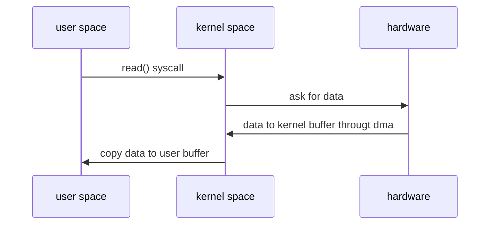

## 一.什么是I/O
I/O 是机器获取和交换信息的主要渠道，而流是完成 I/O 操作的主要方式。其中等待数据准备花费时间好远大于将数据从内核读到用户空间。
- 同步异步:数据从内核读到用户空间是否阻塞。目前linux暂不支持异步。
- 阻塞非阻塞:等待数据准备是否阻塞。
- I/O 模型有五种
    + 阻塞式 I/O
    + 非阻塞式 I/O(需要设置一个线程对该操作进行轮询检查)
    + I/O复用
    + 信号驱动式 I/O
    + 异步 I/O
## 二.传统IO的性能问题
1. 多次内存复制

2. 堵塞
InputStream的read()是一个wehile循环操作,它会一直等待数据读取才返回。这在大量请求的情况下需要创建大量监听线程,如果没有数据就绪就会挂起进入堵塞状态,从而导致大量cpu上下文的切换。

### 三.NIO如何优化
1. 多次内存复制
2. 使用 DirectBuffer 减少内存复制
3. 避免阻塞，优化 I/O 操作

### 四.I/O复用
Linux 提供了 I/O 复用函数 select/poll/epoll,进程将一个或者多个读操作通过系统调用函数1,堵塞在函数操作上.这样系统内核就可以帮我们侦测多个读操作是否处于就绪状态。
1. poll和select类似,管理多个描述符也是通过轮询方式,存在包含大量文件描述符的数组被整体复制到用户态和内核的地址空间之间。但select是基于数组实现的,单个进程监视的fd数量是默认的1024,poll通过修改定义设置重新编译内核方式打破这一限制。但由于fd_set是基于数据实现的,在新增和删除fd时数量过大会导致效率降低。
2. epoll使用事件驱动方式代替轮询扫描fd.epoll事先通过epoll_ctl来注册一个文件描述复,将文件描述符放到内核的一个事件表中,这个事件表是基于红黑数实现的，在大量I/O请求场景下,插入和删除性能select/poll的数组fd_set好,且不受fd数量限制。

### 五.并发模型
#### 5.1 关键点
1. 服务器怎么管理连接
2. 服务器怎么处理请求
#### 5.2 PPC
PPC是每次有新的连接都新建一个进程专门处理。该模式比较适合服务器的连接数没那么多的情况。弊端有fork代价高,父子进程通信麻烦,支持的并发连接数有限。

##### prefork
prefork是启动是预先创建好进程然后才开始接受请求。该模式也有进程通信麻烦和并发数有限问题。

#### 5.3 TPC
TPC是每次有新的连接都创建一个线程专门处理。该模式解决了fock代价高和进程通信问题，但也引入了线程安全问题。

##### prethread
prethread是启动是预先创建好线程然后才开始接受请求。prethread 理论上可以比 prefork 支持更多的并发连接。

#### 5.4 Reactor
Reactor是非阻塞同步网络模型,采用I/O多路复用结合线程池方式,解决TPC和PPC资源利用率低的问题和进程线程如何高效处理连接业务问题.
##### 5.4.1 单Reactor 单进程/线程
该模式简单,没有进程线程通信,没有进程线程竞争。但缺点也明显,没法发挥多核CPU的性能,Handler处理连接业务时无法处理其他连接导致性能瓶颈。因此该模式只使用于业务处理非常快的场景,例如redis。

##### 5.4.2 单Reactor 多线程
该模式能充分发挥多核CPU的处理能力，但也存在问题，多线程数据共享和访问复杂，Reactor承担所有事件监听和响应，瞬间高并发时会成为瓶颈。

##### 5.4.3 多Reactor 多进程/线程
目前著名的开源系统Nginx采用的是多Reactor多进程采用多Reactor多线程的实现有Memcache和Netty。

#### 5.5 Proactor
Proactor是非阻塞异步步网络模型

#### 5.6 模式的选择
+ 海量连接(成千上万)海量请求:例如抢购,双十一等.Reactor和Proactor。
+ 常量连接(几十上百)海量请求:例如中间件.PPC和TPC也适用。
+ 海量连接常量请求:例如门户网站（连接的用户多但请求数量少）.Reactor和Proactor。
+ 常量连接常量请求:例如内部运营系统，管理系统.PPC和TPC也适用。
